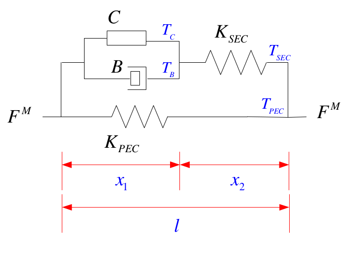
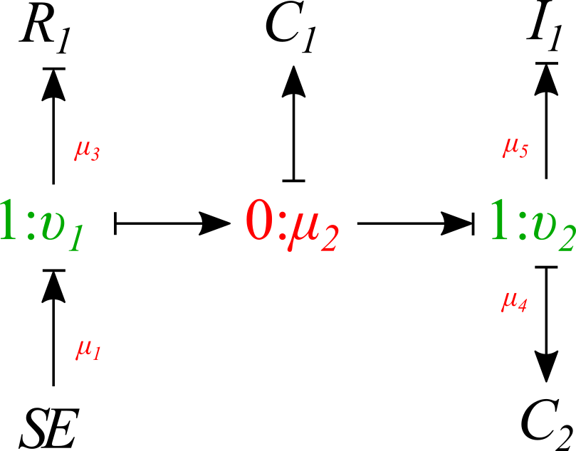

.. _dtp_cp_project_bondgraphs:

Project: Bond Graph
===================

This project was created as part of the Computational Physiology module in the `MedTech CoRE 
<http://medtech.org.nz>`_ Doctoral Training Programme. 

This project requires you to put together what you have learned in the tutorials to define a complete workflow which will create the Hill muscle model using the bond graph technique to simulate the human gait motion.

Outline
-------

The Hill muscle model showed in :numref:`fig_dtp_cp_bondgraphproject_mechanical` can be represented with the Bond Graph technique using *1*-junctions for common velocity points, *0*-junctions for common force points, an tension source *S*\ :sub:`e` for the contractile tension, a resistor element *R* for the mechanical damper, and two capacitor elements *K* for springs.

The linear force F\ :sup:`M` produced by a muscle can be transformed to an applied torque at a body joint through a modulated transformer element *MTF* whose modulus *r* reflects the moment arm from a muscle's attachment point center of rotation. This modulus *r* is a function of the joint angel :math:`{\theta}` and depends on the physiological data of each muscle.

:numref:`fig_dtp_cp_bondgraphproject_mechanical` illustrates the Hill model. There are four basic elements in it: 1) contractile element, *C*; 2) damping element, *B*; 3) series elastic component, :math:`K_{SEC}` ; and 4) parallel elastic component, :math:`K_{PEC}`.

In this project we create the Hill muscle model using the bond graph technique.

.. _fig_dtp_cp_bondgraphproject_mechanical:

   Hill model.

Tips for completing the project
-------------------------------

* *Contractile element:* The contractile element *C* is the **active** element in an extrafusal motor unit. It corresponds to the role played by voltage in an electronic circuit. *C* responds to motoneuron inputs by contracting. Thus, the tension T\ :sub:`C` that it produces always acts to try to shorten the muscle. *C* is incapable to produce an extension force. 

* *The elastic elements:* A muscle when passively stretched exhibits an elastic restoring force that tends to return the muscle to its original length. In part this force is due to stretching the connective tissue that surrounds the muscle fibers. In part it may be due to stretching the tendons which terminate muscle tissue and attach it to the bone. There is a reason to believe that the muscle fibers themselves are at least partly elastic. It is this elastic restoring force that is represented by the elastic elements (springs) in the Hill model. It is not completely correct to assign these elements to any particular physical source, but we may regard the :math:`K_{PEC}` as being mostly due to the connective tissues and the :math:`K_{SEC}` as being primarily dominated by tendon fibers terminating specific motor units. We should note that :math:`K_{PEC}` and :math:`K_{SEC}` are functions of lengths and therefore are non-linear springs.

* *The damper element:* It is an empirical factor that muscle tension during contraction and the speed of the contraction are coupled to each other. Hill found that the relation between them follows a characteristic hyperbolic equation, now known as Hill's equation. Such elastic elements, the damper coefficient *B* is a function of the contraction speed, therefore is a nonlinear damper.

The full Bond Graph muscle model is shown in :numref:`fig_dtp_cp_bondgraphproject_bondgraph`.

.. _fig_dtp_cp_bondgraphproject_bondgraph:

   Full Bond Graph muscle model.
