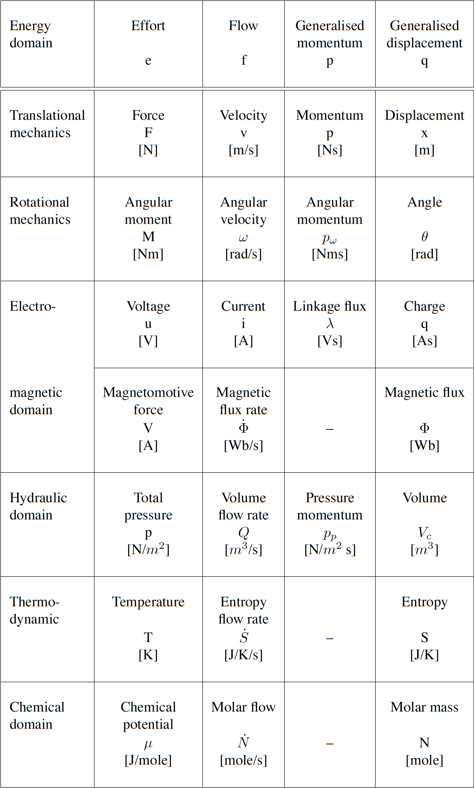
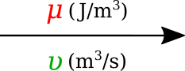
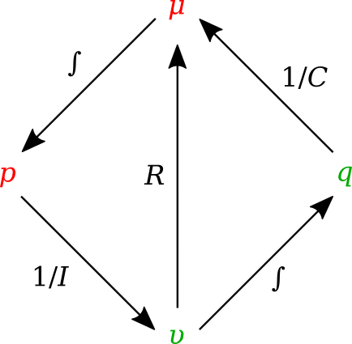
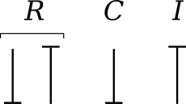
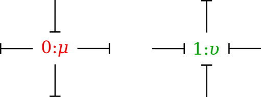
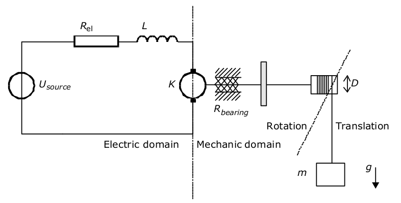

.. _dtp_cp_project_bondgraphs:

Project: Bond Graph
===================

Introduction
------------

The bond graph approach to formulating models dealing with mass and energy transfer was developed by Henry Paynter in the 1960s to represent electro-mechanical control systems :cite:`paynter1961analysis`. It was later extended to include chemical processes by :cite:`breedveld1984physical`, including concepts from the theory of network thermodynamics by Aharon Katchalsky and colleagues :cite:`oster1971network`. Papers by Peter Gawthrop and Edmund Crampin have brought the approach into the bioengineering domain :cite:`gawthrop2014energy,gawthrop2015hierarchical,gawthrop2015energetic,gawthrop2016modular`.

The first key idea, based on recognising that energy and power are the only quantities that are common across different physical systems, is to separate energy transmission from storage and dissipation, and to provide the concept of *potential* (called "effort" in the engineering literature) with units of Joules per some_quantity as the common driving force behind the *flow* of that some_quantity per second. The product of potential and flow is then always power in units of Joules per second. The "some_quantity" has units of metres, meters\ :sup:`3`\, coulombs, candela, moles or entropy for, respectively, rigid body mechanics, continuum mechanics (including fluid flow), electrical, electromagnetic, chemical and heat transfer processes. As explained further below, the second key concept is that of a *0-junction*, where potential is defined and mass balance is applied, and a *1-junction*, where flow is defined and energy balance is applied. The extraordinary utility of these concepts is to recognise that Kirchhoff's voltage law in electrical circuits, Newton's force balance in a mechanical system, and stoichiometric balance in a biochemical system, are all just different manifestations of the same underlying principle of energy conservation and can therefore be represented by the same bond graph equation.

Units
-----

Many physical systems can be described by a driving *potential* expressed as Joules per unit of some quantity, and a *flow* expressed as that quantity per second. The quantity could be coulomb, meters, moles, *etc.* in different physical systems. The power is always the product of the driving force and the flow expressed as Joules per second. The seven units of the SI system under the newly proposed definitions are now based on constants that are consistent with the use of Joules and seconds (together covering energy and power), metres, moles, entropy, coulombs and candela. :numref:`fig_dtp_cp_bondgraphproject_table` displays the bond graph concepts in different energy domains.

.. _fig_dtp_cp_bondgraphproject_table:

   Power and energy variables in various energy domains.

Formulation
-----------

In bond graph formulation, there are four basic variables. These variables for different physical systems are listed in . In electrical engineering these variables are given by: potential :math:`\mu` is energy density or `voltage` (J.C :sup:`-1`), flow :math:`\upsilon` is `current` (C.s :sup:`-1`), time integral of potential :math:`p` is `momentum` (J.s.C :sup:`-1`) and time integral of flow :math:`q` is quantity or `coulombs` (C). Product :math:`\mu .\upsilon` is power (J.s :sup:`-1`) which is a generalised coordinate to model the complete systems residing in several energy domains. A bond with covariables :math:`\mu` and :math:`\upsilon` is therefore used to represent `transmission of energy`. The bond represents a mechanism for the transmission of energy and power, and the arrow head indicates the assumed direction of power flow (see :numref:`fig_dtp_cp_bondgraphproject_bond`). The flow :math:`\upsilon` and potential :math:`\mu` must satisfy conservation laws.

.. _fig_dtp_cp_bondgraphproject_bond:

   Representation of energy bond.

Bond graph elements
-------------------

Bond graph formulation is a graphical notation for the set of linear constraint equations (the conservation laws), but the constitutive relations can be nonlinear.

The constitutive equations of the bond graph elements are introduced via examples from the electrical and mechanical domains. The nature of the constitutive equations lay demands on the causality of the connected bonds. Bond graph elements are drawn as letter combinations (mnemonic codes) indicating the type of element. The bond graph elements are the following:

* `C`: static storage element, `e.g.` capacitor (stores charge), spring (stores displacement).

* `I`: dynamic storage element, `e.g.` inductor (stores flux linkage), mass (stores momentum).

* `R`: resistor dissipating free energy, `e.g.` electric resistor, mechanical friction.

* `SE` and `SF`: sources, `e.g.` electric mains (voltage source), gravity (force source), pump (flow source).

* `TF`: transformer, `e.g.` an electric transformer, toothed wheels, lever.

* `GY`: gyrator, `e.g.` electromotor, centrifugal pump.

* `0` and `1`: `0-junctions` and `1-junctions`, for ideal connecting two or more submodels.

:numref:`fig_dtp_cp_bondgraphproject_tetra` shows the relation of the state variables to the constitutive relations.

.. _fig_dtp_cp_bondgraphproject_tetra:

   State variables and constitutive relations in the bond graph approach.

Storage elements
~~~~~~~~~~~~~~~~~~

Storage elements store all kinds of free energy. As indicated above, there are two types of storage elements: `C-elements` and `I-elements`. In `C-elements`, like a capacitor or spring, the conserved quantity, `q`, is stored by accumulating the net flow, :math:`\upsilon`, to the storage element. This results in the differential equation:

.. math::

   \dot q=\upsilon

which is called a balance equation, and forms a part of the constitutive equations of the storage element. In the other part of the constitutive equations, the state variable, `q`, is related to the potential:

.. math::

   \mu=\dfrac{q}{C}

In `I–elements`, like an inductor or mass, the conserved quantity, `p`, is stored by accumulating the net potential, :math:`\mu`, to the storage element. The resulting differential equation is:

.. math::

   \dot p=\mu

which is the balance equation. The element-specific part of the constitutive equations is:

.. math::

   \upsilon=\dfrac{p}{I}

Resistors
~~~~~~~~~

Resistors, `R–elements`, dissipate free energy. Examples are dampers, frictions and electric resistors. The constitutive equation is an algebraic relation between the potential and flow.

.. math::

   \mu=\upsilon R

Sources
~~~~~~~

Sources represent the interaction of a system with its environment. Examples are external forces, voltage and current sources, ideal motors, `etc.` Depending on the type of the imposed variable, these elements are drawn as `SE` or `SF`.

Transformers
~~~~~~~~~~~~

An ideal transformer is represented by `TF` and is power continuous (`i.e.` no power is stored or dissipated). The transformation can within the same domain (toothed wheel, lever) or between different domains (electromotor, winch). The equations are:

.. math::

   \mu_1=n \mu_2

.. math::

   \upsilon_2=n \upsilon_1

Potentials are transduced to potentials and flows to flows. The parameter `n` is the transformer ratio. Due to the power continuity, only one dimensionless parameter, `n`, is needed to describe both the potential transduction and the flow transduction. The parameter `n` is unambiguously defined as follows: :math:`\mu`:sub:`1` and :math:`\upsilon`:sub:`1` belong to the bond pointing towards the `TF`. If `n` is not constant, the transformer is a modulated transformer, a `MTF`. The transformer ratio now becomes an input signal to the `MTF`.

Gyrators
~~~~~~~~

An ideal `gyrator` is represented by `GY`, and is also power continuous (`i.e.` no power is stored or is dissipated. Examples are an electromotor, a pump and a turbine. Real-life realisations of gyrators are mostly transducers representing a domain-transformation. The equations are:

  .. math::

     \mu_1=r \upsilon_2

  .. math::

     \mu_2=r \upsilon_1

The parameter `r` is the `gyrator ratio`, and due to the power continuity, only one parameter to describe both equations. No further definition is needed since the equations are symmetric (it does not matter which bond points inwards, only that one bond points towards and the other points form the gyrator). `r` has a physical dimension, since `r` is a relation between effort and flow (it has the same dimension as the parameter of the `R-element`). If `r` is not constant, the gyrator is a `modulated gyrator`, a `MGY`.

Junctions
~~~~~~~~~

Junctions couple two or more elements in a power continuous way: there is no energy storage or dissipation in a junction. Examples are a series connection or a parallel connection in an electrical network, a fixed coupling between parts of a mechanical system.

The `0-junction` represents a node at which all potentials of the connecting bonds are equal. An example is a parallel connection in an electrical circuit. Due to the power continuity, the sum of the flows of the connecting bonds is zero, considering the sign. The power direction (`i.e.` direction of the arrow) determines the sign of the flows: all inward pointing bonds get a plus and all outward pointing bonds get a minus. This summation is the Kirchhoff current law in electrical networks: all currents connecting to one node sum to zero, considering their signs: all inward currents are positive and all outward currents are negative. We can depict the `0-junction` as the representation of a potential variable, and often the `0-junction` will be interpreted as such. The `0-junction` is more than the (generalised) Kirchhoff current law, namely also the equality of the potentials (like electrical voltages being equal at a parallel connection).

The `1-junction` is the dual form of the `0-junction` (roles of potential and flow are exchanged). The `1-junction` represents a node at which all flows of the connecting bonds are equal. An example is a series connection in an electrical circuit. The potentials sum to zero, as a consequence of the power continuity. Again, the power direction (`i.e.` direction of the arrow) determines the sign of the potentials: all inward pointing bonds get a plus and all outward pointing bonds get a minus. This summation is the Kirchhoff voltage law in electrical networks: the sum of all voltage differences along one closed loop (a mesh) is zero. In the mechanical domain, the `1–junction` represents a force balance (also called the principle of d’Alembert), and is a generalisation of Newton’s third law, action = – reaction). Just as with the `0–junction`, the `1–junction` is more than these summations, namely the equality of the flows. Therefore, we can depict the `1–junction` as the representation of a flow variable, and often the `1-junction` will be interpreted as such.

Causality
~~~~~~~~~

Causality establishes the cause and the effect relationship. It specifically implies that either the potential or flow variable on that bond is known. Causality is generally indicated by a causal stroke at the end to which the potential receiver is connected. Elements which store or dissipate energy do not impose causality on the system, but they have preferred causality for computational reasons. These elements with their preferred causality are shown in :numref:`fig_dtp_cp_bondgraphproject_causality_element`.

.. _fig_dtp_cp_bondgraphproject_causality_element:

   Preferred causality for `R`, `C`, and `I` elements.

In the bond graph approach, junctions interconnect the corresponding elements and constrain the possible causalities of the element ports connected to it. A `0-junction` can only have one potential output. In a similar way, a `1-junction` can only have one flow output. :numref:`fig_dtp_cp_bondgraphproject_causality_jun` illustrates causality in four-port `0-junction` and `1-junction`.

.. _fig_dtp_cp_bondgraphproject_causality_jun:

   Causality in four-port `0-junction` and `1-junction`.

Procedure
---------

To generate a bond graph model starting from an ideal-physical model (IPM), a systematic method exist, which we will present here as a procedure. This procedure consists roughly of the identification of the domains and basic elements, the generation of the connection structure (called the junction structure), the placement of the elements, and possibly simplifying the graph. The procedure is different for the mechanical domain compared to the other domains. These differences are indicated between parenthesis. The reason is that elements need to be connected to difference variables or across variables. The potentials in the non-mechanical domains and the flows in the mechanical domains are the across variables we need.

Step 1 and 2 concern the identification of the domains and elements.

1. Determine which physical domains exist in the system and identify all basic elements like *C*, *I*, *R*, *SE*, *SF*, *TF* and *GY*. Give every element a unique name to distinguish them from each other.

2. Indicate in the ideal-physical model per domain a reference potential (reference flow with positive direction for the mechanical domains). Note that only the references in the mechanical domains have a direction.

Steps 3 through 6 describe the generation of the connection structure (called the junction structure).

3. Identify all other potentials (mechanical domains: flows) and give them unique names.

4. Draw these potentials (mechanical: flows), and not the references, graphically by `0-junctions` (mechanical: `1-junctions`). Keep if possible, the same layout as the IPM.

5. Identify all potential differences (mechanical: flow differences) needed to connect the ports of all elements enumerated in step 1 to the junction structure. Give these differences a unique name, preferably showing the difference nature. The difference between  :math:`\mu`:sub:`1` and :math:`\mu`:sub:`2` can be indicated by :math:`\mu` :sub:`12`.

6. Construct the potential differences using a `1-junction` (mechanical: flow differences with a `0-junction`) and draw them as such in the graph. The junction structure is now ready and the elements can be connected.

7. Connect the port of all elements found at step 1 with the `0-junctions` of the corresponding potential or potential differences (mechanical: `1-junctions` of the corresponding flows or flow differences).

8. Simplify the resulting graph by applying the following simplification rules:

   * A junction between two bonds can be left out, if the bonds have a ‘through’ power direction (one bond incoming, the other outgoing).

   * A bond between two the same junctions can be left out, and the junctions can join into one junction.

   * Two separately constructed identical potential or flow differences can join into one potential or flow difference.

We will illustrate these steps with a concrete example in the next section.

Project outline
---------------

This project was created as part of the Computational Physiology module in the `MedTech CoRE <http://medtech.org.nz>`_ Doctoral Training Programme.

This project requires you to put together what you have learned in the tutorials to define a complete workflow which will create a hoisting device model using the bond graph technique. The hoisting device consists of an electromotor fed by electric mains, a cable drum and a load (:numref:`fig_dtp_cp_bondgraphproject_schematic`).

.. _fig_dtp_cp_bondgraphproject_schematic:

.. figure:: _static/schematic.png
   :align: center
   :width: 50%

   Sketch of the hoisting device.

The mains is modelled as an ideal voltage source. At the electromotor, the inductance, electric resistance of the coils, bearing friction and rotary inertia are taken into account. The cable drum is the transformation from rotation to translation, which we consider as ideal. The load consists of a mass and the gravity force. Starting from the schematic in :numref:`fig_dtp_cp_bondgraphproject_model`, you would be able to construct a bond graph model using the steps mentioned above.

.. _fig_dtp_cp_bondgraphproject_model:

   Possible ideal-physical model augmented with the domain information of step 1.

Additional info
---------------

* Voltage source is constant with given value of :math:`20` J.C\ :sup:`-1`.

* Load and rotary inertia are :math:`1` J.s\ :sup:`2` .m\ :sup:`-2` and :math:`2` J.s\ :sup:`2` .rad\ :sup:`-2`, respectively.

* Electric resistance is :math:`10000` J.s.C\ :sup:`-2` and bearing friction is :math:`10` J.s.rad\ :sup:`-2`.

* Gyrator ratio and transformer ratio are :math:`3` J.s.C\ :sup:`-1` .m\ :sup:`-1` and :math:`5`, respectively.

Simulation
-------------------------------

Using the bond graph model, now we can derive the equations and implement them in OpenCOR. The equations that we are looking for are: conservation of flow for `0-junctions`, conservation of energy for `1-junctions`, and constitutive relations for the elements. The input boundary condition for solving this system of ODEs is the voltage source or *SE* in the bond graph model. By running the simulation, you would be able to plot the potential and flow for all the elements in time.

.. bibliography:: refs.bib
