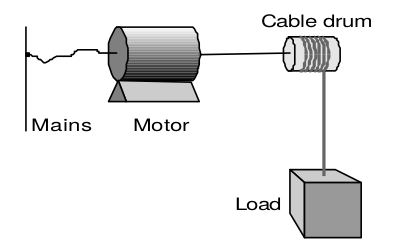

.. _dtp_cp_project_bondgraphs:

Project: Bond Graph
===================

This project was created as part of the Computational Physiology module in the `MedTech CoRE <http://medtech.org.nz>`_ Doctoral Training Programme.

Project outline
---------------

This project requires you to put together what you have learned in the tutorials to define a complete workflow which will create a hoisting device model using the bond graph technique. The hoisting device consists of an electromotor fed by electric mains, a cable drum and a load (:numref:`fig_dtp_cp_bondgraphproject_schematic`).

.. _fig_dtp_cp_bondgraphproject_schematic:

   Sketch of the hoisting device.

The mains is modelled as an ideal voltage source. At the electromotor, the inductance, electric resistance of the coils, bearing friction and rotary inertia are taken into account. The cable drum is the transformation from rotation to translation, which we consider as ideal. The load consists of a mass and the gravity force. Starting from the schematic in :numref:`fig_dtp_cp_bondgraphproject_model`, you would be able to construct a bond graph model using the steps mentioned before.

.. _fig_dtp_cp_bondgraphproject_model:

   Possible ideal-physical model augmented with the domain information.

Additional info
---------------

* Voltage source is constant with given value of :math:`20` J.C\ :sup:`-1`.

* Load and rotary inertia are :math:`1` J.s\ :sup:`2` .m\ :sup:`-2` and :math:`2` J.s\ :sup:`2` .rad\ :sup:`-2`, respectively.

* Electric resistance is :math:`10000` J.s.C\ :sup:`-2` and bearing friction is :math:`10` J.s.rad\ :sup:`-2`.

* Gyrator ratio and transformer ratio are :math:`3` J.s.C\ :sup:`-1` .m\ :sup:`-1` and :math:`5`, respectively.

Simulation
-------------------------------

Using the bond graph model, now we can derive the equations and implement them in OpenCOR. The equations that we are looking for are: conservation of flow for `0-junctions`, conservation of energy for `1-junctions`, and constitutive relations for the elements. The input boundary condition for solving this system of ODEs is the voltage source or *SE* in the bond graph model. By running the simulation, you would be able to plot the potential and flow for all the elements in time.

.. bibliography:: refs.bib
